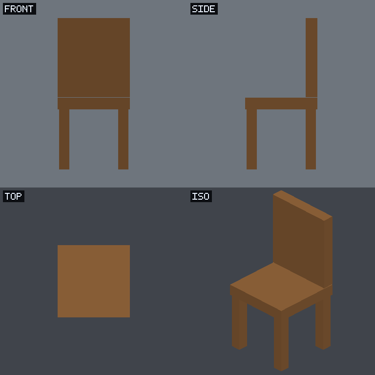

# Chisel

[](https://buy.polar.sh/polar_cl_v4ZIuYffdbN9E9iVLmlHh1W5sxAmxvqNVqIn81048FX)

**An MCP server that lets AI agents build, edit, render, and export real 3D models** —
from geometric primitives and boolean CSG. No diffusion, no GPU, no browser. The agent
calls modeling tools, gets back a multi-view render to *see* its work, iterates, and
exports clean `.glb`/`.obj`.



> Every model is real, editable geometry — boxes, spheres, cylinders, cones combined with
> `union` / `subtract` / `intersect` and mirrored for symmetry. The render above (a chair
> built from 9 tool calls) is produced by a **pure-CPU software rasterizer** — the same
> thing the agent sees each step.

## Why

Image/mesh diffusion models paint surfaces — you get a blob you can't cleanly edit or
boolean. Chisel takes the opposite approach: give an agent a **discrete, inspectable
modeling API** and a **see-and-revise loop**, and it builds real solids you can open in
Blender, slice for printing, or drop into a game engine.

The hard part of 3D-by-agent isn't geometry, it's **occlusion** — any single view hides
half the model. So Chisel renders four canonical views every step (front / side / top /
iso) and hands them back as an image, so the agent reasons about the whole form, not one
face.

## Quick start

Run the server (stdio):

```bash
# zero-install, straight from GitHub (builds on first run)
npx -y github:EYamanS/chisel

# …or from a clone
git clone https://github.com/EYamanS/chisel && cd chisel
npm install
npm run mcp
```

Wire it into any MCP client (`claude_desktop_config.json`, `.mcp.json`, etc.):

```json
{
  "mcpServers": {
    "chisel": {
      "command": "npx",
      "args": ["-y", "github:EYamanS/chisel"],
      "env": { "CSG_OUTPUT_DIR": "/absolute/path/to/exports" }
    }
  }
}
```

Or point at a local clone for speed:

```json
{
  "mcpServers": {
    "chisel": {
      "command": "node",
      "args": ["/absolute/path/to/chisel/dist/server.js"],
      "env": { "CSG_OUTPUT_DIR": "/absolute/path/to/exports" }
    }
  }
}
```

Then just ask your agent: *"model a coffee mug and export it as a glb."*

## Tools

| Tool | What it does |
|------|--------------|
| `add_box` `add_sphere` `add_cylinder` `add_cone` | Add a primitive (size/radius/height, position, rotation, color). |
| `transform` | Move / rotate / scale an object (absolute or relative). |
| `union` `subtract` `intersect` | Boolean CSG — fuse, carve a hole, or clip to an overlap. |
| `mirror` | Reflect an object across X/Y/Z. Composes with booleans — build one side, mirror it. |
| `set_color` `delete` `select` | Recolor, remove, highlight. |
| `get_scene` | Return the scene graph as text (every object, shape, transform). |
| `render` | Return a 2×2 multi-view PNG (front/side/top/iso) so the agent can **see** the model. |
| `export_model` | Write `.glb` or `.obj` to disk; returns the path. `inline:true` for base64. |
| `reset` | Clear the session to an empty scene. |

Models persist per `session` id (default `main`) for the life of the process, so an agent
builds incrementally across calls. Rendering is **GPU-free** (a software rasterizer over
the evaluated CSG triangles), so it runs anywhere Node runs — laptops, CI, containers.

## A typical agent loop

```
add_cylinder { radius: 0.6, height: 1.2, position: [0, 0.6, 0], color: "steel" }   -> obj1
add_cylinder { radius: 0.46, height: 1.1, position: [0, 0.74, 0] }                 -> obj2
subtract     { a: "obj1", b: "obj2" }   # hollow it out                            -> obj3
render       # look at all four views, notice it needs a handle
add_box      { size: [0.16, 0.62, 0.16], position: [0.66, 0.62, 0], color: "steel" }
union        { a: "obj3", b: "obj4", name: "mug" }
render       # looks right
export_model { format: "glb" }          # -> ./exports/main-<ts>.glb
```

## Web playground (optional)

The repo also ships an interactive Next.js playground where an OpenAI model drives the
same engine in your browser, with a live 3D viewport and glTF/OBJ export:

```bash
cp .env.local.example .env.local   # add OPENAI_API_KEY
npm run dev                        # http://localhost:3000
```

The **Demo** buttons (Mug / Table / Rocket) exercise the full engine with no API key.

## How it works

```
src/lib/scene/    types.ts        scene graph: flat list of CSG expression trees
                  operations.ts   deterministic reducer — applies one tool call
                  tools.ts        modeling tool schemas (shared by MCP + web agent)
src/lib/three/    build.ts        scene graph -> Three.js meshes (evaluates CSG)
src/lib/render/   raster.ts       headless software renderer (no GPU) -> 2x2 PNG
                  export.ts       glTF/OBJ export | png.ts encoder | font.ts labels
src/mcp/          server.ts       MCP server (stdio) | engine.ts session store
src/lib/agent/    loop.ts         web playground's render->see->revise agent loop
src/components/   Viewport.tsx    browser viewport (WebGL) + capture + export
src/app/          page.tsx        playground UI | api/agent/route.ts OpenAI proxy
```

The MCP server and the web playground are two front-ends over **one engine** — same scene
graph, same CSG, same tool schemas. The MCP path is fully headless (software-rendered);
the web path uses WebGL for the interactive viewport.

## Development

```bash
npm run mcp         # run the MCP server from source (tsx)
npm run build:mcp   # bundle the self-contained binary -> dist/server.js
npm run dev         # web playground
npm run build       # production build of the web app
```

## Support

Built this in the open. If it saved you time, a one-off tip keeps it maintained:

[](https://buy.polar.sh/polar_cl_v4ZIuYffdbN9E9iVLmlHh1W5sxAmxvqNVqIn81048FX)

## License

MIT © Emir Yaman Sivrikaya
